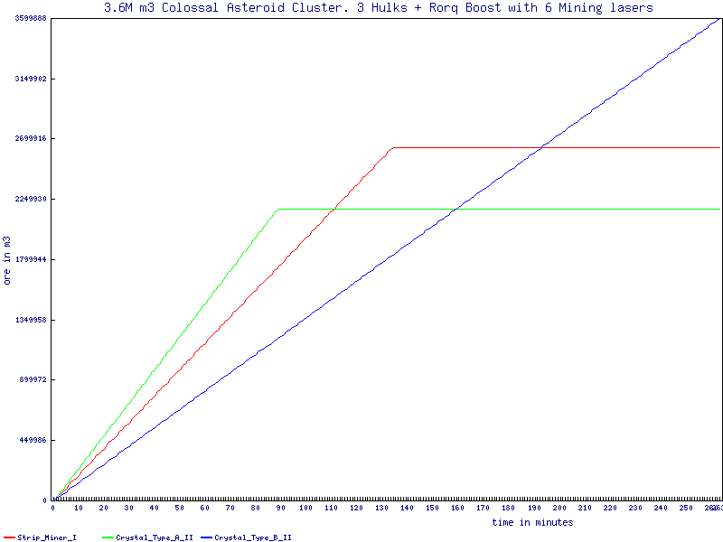

# EveOnlineMiningYield
This is a followup to a [reddit post](https://www.reddit.com/r/Eve/comments/5bp0sm/mining_yield_with_the_november_update/) which shows the comparison of the different combinations of mining ships and boost.

Currently this page excludes Mercoxit and Gas yields.

# Residue Mechanic

> Residue probability is the likelihood that the mining laser will [..] destroy some of the yet untapped resources in the asteroid each cycle [..]

-- <cite>[Patch Notes 19.11 #1](https://www.eveonline.com/news/view/patch-notes-version-19-11)</cite>

* Depending on the residue probability ore is removed from the asteroid additional to the mined ore amount.
* The waste is removed from the asteroid after mining happened, therefore this mechanic does not affect mining yield per cycle.

The ore wasted in this way affects:
1. the time needed to deplete the ore site 
2. the overall ore gathered after completing the mining operation.

## Residue Crystal Type A and B Comparison

This example Scenario consists of three Hulks with Rorqual Boost mining a Colossal Asteroid Cluster filled with 3.6M m3 (Bistot and Arkonor). In order to compare the crystal types the Rorqual drones are not used in this example.

|Crystal Type|Cluster Depleted|Ore Mined|
|:-|:-|:-|
|Crystal_Type_A_II|130 min|2.556M m3|
|Crystal_Type_B_II|88 min|2.176M m3|


1. Additional time needed to deplete the ore site with type A: 42 min (32.04%)
2. Additional ore gathered after completing the mining operation with type A: 0.403M (15.44%)



# Ore Mining Yield

Yield values for Ore.

## Ship Yields
The game displays the outcome of mining yield in the tooltip of the mining laser. For example when a hulk is boosted to the maximum possible value it displays a **68.6m3/s** value on its mining laser see this example screenshot: 


The following table shows the yield in m3/s per *mining laser* (ingame values)

|Ship|no Boost|Porpise Boot|Orca Boost|Orca ICT1 Boost|Orca ICT2 Boost|Rorqual Boost|Rorqual ICT1 Boost|Rorqual ICT2 Boost|
|:-|:-|:-|:-|:-|:-|:-|:-|:-|
|     Venture|    6.71|   10.93|   10.63|   11.29|   11.65|   11.96|   15.64|   17.43|
|   Endurance|   15.93|   25.98|   25.26|   26.83|   27.69|   28.43|   37.17|   41.41|
|    Prospect|   10.86|   17.70|   17.21|   18.28|   18.86|   19.37|   25.32|   28.21|
|    Procurer|   14.02|   22.86|   22.23|   23.61|   24.37|   25.02|   32.71|   36.44|
|   Retriever|   16.13|   26.29|   25.56|   27.15|   28.02|   28.77|   37.61|   41.91|
|     Covetor|   19.55|   31.87|   30.98|   32.91|   33.96|   34.87|   45.59|   50.80|
|       Skiff|   15.42|   25.15|   24.45|   25.97|   26.80|   27.52|   35.98|   40.09|
|    Mackinaw|   19.55|   31.87|   30.98|   32.91|   33.96|   34.87|   45.59|   50.80|
|        Hulk|   26.38|   43.01|   41.81|   44.41|   45.83|   47.06|   61.53|   68.55|


The following table shows the Yield in m3/s per *ship* (multiple mining lasers)

|Ship|no Boost|Porpise Boot|Orca Boost|Orca ICT1 Boost|Orca ICT2 Boost|Rorqual Boost|Rorqual ICT1 Boost|Rorqual ICT2 Boost|
|:-|:-|:-|:-|:-|:-|:-|:-|:-|
|     Venture|   13.41|   21.87|   21.26|   22.58|   23.31|   23.93|   31.28|   34.86|
|   Endurance|   15.93|   25.98|   25.26|   26.83|   27.69|   28.43|   37.17|   41.41|
|    Prospect|   21.71|   35.40|   34.42|   36.55|   37.73|   38.73|   50.64|   56.43|
|    Procurer|   28.04|   45.73|   44.45|   47.22|   48.73|   50.03|   65.42|   72.89|
|   Retriever|   32.25|   52.59|   51.12|   54.30|   56.04|   57.54|   75.23|   83.82|
|     Covetor|   39.09|   63.74|   61.97|   65.82|   67.93|   69.74|   91.19|  101.60|
|       Skiff|   30.85|   50.30|   48.90|   51.94|   53.61|   55.03|   71.96|   80.18|
|    Mackinaw|   39.09|   63.74|   61.97|   65.82|   67.93|   69.74|   91.19|  101.60|
|        Hulk|   52.76|   86.02|   83.62|   88.82|   91.67|   94.11|  123.05|  137.11|


The formula behind this table is calculated as followed:

```perl
	# skills 
	my $Mining_Skill                   = 5;
	my $Astrogeology_Skill             = 5;
	my $Mining_Director_Skill          = 5;
	my $Capital_Industrial_Ships_Skill = 5;
	my $Mining_Barge_Skill             = 5;
	my $Exhumer_Skill                  = 5;

	# factors 
	my $Mining_Foreman_Mindlink_bonus_1  = (1+0.25);
	my $Mining_Laser_optimization_base_1 = 0.15;
	my $Tech_2_Command_Burst_Modules_1   = (1+0.25);
	my $T2_Industrial_Core               = (1+0.40);
	my $Highwall_Mining_MX1005_Implant   = (1+0.05);
	my $mining_upgrades_x3               = (1+0.295);

	# Minig Crystal II Attribute
	my $Asteroid_Specialization_Yield_Modifier =  1.8;
	my $Asteroid_Specialization_Duration_Modifier =  0.8;

	# Modulated Strip Miner II Attribute
	my $Strip_Miner_II_Mining_Amount = 480;
	my $Strip_Miner_II_Cycle_Time    = 180;

	my $rorqual_boost_t2 = $Mining_Laser_optimization_base_1
		* $Tech_2_Command_Burst_Modules_1
		* $T2_Industrial_Core
		* (1+0.1 * $Mining_Director_Skill)
		* $Mining_Foreman_Mindlink_bonus_1
		* (1+0.05*$Capital_Industrial_Ships_Skill) ;
	
	my $boost_factor = (1- $rorqual_boost_t2);

	my $hulk_base_yield =  $Strip_Miner_II_Mining_Amount 
		* $Asteroid_Specialization_Yield_Modifier
		* (1+0.05*$Mining_Skill) 
		* (1+0.05*$Astrogeology_Skill)
		* (1+0.03*$Mining_Barge_Skill) 
		* (1+0.06*$Exhumer_Skill) 
		* $Highwall_Mining_MX1005_Implant
		* $mining_upgrades_x3 ;

	my $hulk_base_time =    $Strip_Miner_II_Cycle_Time 
		* $Asteroid_Specialization_Duration_Modifier
		* (1-0.03*$Exhumer_Skill)
		* (1-0.15)  # role bonus
		* $boost_factor;

	my $mining_yield_per_second = $hulk_base_yield / $hulk_base_time;
	printf("m3/s     %3.2f\n", $mining_yield_per_second); # prints 68.55
```

Mining frigates are all fitted with a Modulated Deep Core Miner II and a Mining Crystal II rather than a Miner II in order to achieve max yield on these ships.

## Drone Yields

The Mining amount of ore collected via drones is listed in the attributes section of the info window for each drone.

The highest in-game value is 1440.20 m3


This value is calculated as followed:
```perl
	# skills 
	my $Drone_Interfacing_Skill           = 5;
	my $Mining_Drone_Operation_Skill      = 5;
	my $Mining_Drone_Specialization_Skill = 5;
	my $Industrial_Command_Ships_Skill    = 5;

	# Excavator Mining Drone base yield
	my $drone_base = 80;
	my $drone_yield_per_second = $drone_base
		* (1 + 0.1 * $Industrial_Command_Ships_Skill)
		* (1 + 0.1 * $Drone_Interfacing_Skill)
		* (1 + 0.05 * $Mining_Drone_Operation_Skill)
		* (1 + 0.02 * $Mining_Drone_Specialization_Skill)
		* (1 + 0.15 ) # medium mining drone augmentor II
		* (1 + 0.15 ) # medium mining drone augmentor II
		* (1 + 0.10 ) # medium mining drone augmentor I
		* (1 + 3.00 ); # 300% ic2 bonus

	printf("%3.2f", $drone_yield_per_second); # prints 1440.20
```

The following tables shows the yield in m3 *per 60s drone cycle*

ORE DRONE in_game_value
|Ship|Mining Drone I|Mining Drone II|Augmented Mining Drone|Harvester Mining Drone|Excavator Mining Drone|
|:-|:-|:-|:-|:-|:-|
|     Venture|   68.19|   99.01|  111.02|  114.56|        |
|   Endurance|   61.99|   90.01|  100.92|  104.15|        |
|    Prospect|        |        |        |        |        |
|    Procurer|   68.19|   99.01|  111.02|  114.56|        |
|   Retriever|   68.19|   99.01|  111.02|  114.56|        |
|     Covetor|   59.30|   86.10|   96.54|   99.62|        |
|       Skiff|   61.99|   90.01|  100.92|  104.15|        |
|    Mackinaw|   61.99|   90.01|  100.92|  104.15|        |
|        Hulk|   61.99|   90.01|  100.92|  104.15|        |
|    Porpoise|  153.43|  222.78|  249.79|  257.76|        |
|        Orca|  102.29|  148.52|  166.52|  171.84|        |
|   Orca ICT1|  127.86|  185.65|  208.15|  214.80|        |
|   Orca ICT2|  179.00|  259.91|  291.42|  300.72|        |
|     Rorqual|  102.29|  148.52|  166.52|  171.84|  360.05|
|Rorqual ICT1|  276.18|  401.01|  449.61|  463.97|  972.14|
|Rorqual ICT2|  409.15|  594.08|  666.09|  687.37| 1440.20|


List of Drone Mining Augmentor Rigs (T1 and T2) used to max out drone yield.

|Ship|Drone Rigs|Ore Drones|
|:-|:-|:-|
|     Venture|2xT2 + 1xT1|   0   |
|   Endurance|2xT2       |   3   |
|    Prospect|           |   0   |
|    Procurer|2xT2 + 1xT1|   5   |
|   Retriever|2xT2 + 1xT1|   5   |
|     Covetor|1xT2 + 1xT1|   5   |
|       Skiff|2xT2       |   5   |
|    Mackinaw|2xT2       |   5   |
|        Hulk|2xT2       |   5   |
|    Porpoise|2xT2 + 1xT1|   5   |
|        Orca|2xT2 + 1xT1|   5   |
|     Rorqual|2xT2 + 1xT1|   5   |

The following table shows the yield in m3/s per ship but *does not consider the yield loss caused by drone travel time*. 

ORE DRONE m3_per_second
|Ship|Mining Drone I|Mining Drone II|Augmented Mining Drone|Harvester Mining Drone|Excavator Mining Drone|
|:-|:-|:-|:-|:-|:-|
|     Venture|    2.27|    3.30|    3.70|    1.91|        |
|   Endurance|    3.10|    4.50|    5.05|    1.74|        |
|    Prospect|        |        |        |        |        |
|    Procurer|    5.68|    8.25|    9.25|    9.55|        |
|   Retriever|    5.68|    8.25|    9.25|    9.55|        |
|     Covetor|    4.94|    7.17|    8.04|    8.30|        |
|       Skiff|    5.17|    7.50|    8.41|    8.68|        |
|    Mackinaw|    5.17|    7.50|    8.41|    8.68|        |
|        Hulk|    5.17|    7.50|    8.41|    8.68|        |
|    Porpoise|   12.79|   18.57|   20.82|   21.48|        |
|        Orca|    8.52|   12.38|   13.88|   14.32|        |
|   Orca ICT1|   10.65|   15.47|   17.35|   17.90|        |
|   Orca ICT2|   14.92|   21.66|   24.28|   25.06|        |
|     Rorqual|    8.52|   12.38|   13.88|   14.32|   30.00|
|Rorqual ICT1|   23.01|   33.42|   37.47|   38.66|   81.01|
|Rorqual ICT2|   34.10|   49.51|   55.51|   57.28|  120.02|

(ICT1 + ICT2 indicates if a Rorqual as the Industrial Core I or Industrial Core II being active.)

# Ice Mining Yield

Yield values for Ice which can be found [in ice belts](https://imperium.news/eve-mining/what-to-mine/#ice_mining)

## Ship Yields

Max yield for Ice is 57.8m3/s as shown in screenshot below


The following table shows the yield in m3/s per *ice harvester* (ingame values)

ICE in_game_value
|Ship|no Boost|Porpise Boot|Orca Boost|Orca ICT1 Boost|Orca ICT2 Boost|Rorqual Boost|Rorqual ICT1 Boost|Rorqual ICT2 Boost|
|:-|:-|:-|:-|:-|:-|:-|:-|:-|
|     Venture|        |        |        |        |        |        |        |        |
|   Endurance|   22.07|   35.99|   34.99|   37.16|   38.36|   39.38|   51.49|   57.37|
|    Prospect|    6.82|   11.12|   10.81|   11.49|   11.85|   12.17|   15.91|   17.73|
|    Procurer|   11.76|   19.17|   18.64|   19.80|   20.43|   20.98|   27.43|   30.56|
|   Retriever|   13.44|   21.91|   21.30|   22.62|   23.35|   23.97|   31.34|   34.92|
|     Covetor|   17.79|   29.00|   28.19|   29.94|   30.90|   31.73|   41.49|   46.22|
|       Skiff|   13.23|   21.57|   20.97|   22.27|   22.99|   23.60|   30.85|   34.38|
|    Mackinaw|   15.12|   24.65|   23.96|   25.45|   26.27|   26.97|   35.26|   39.29|
|        Hulk|   22.23|   36.25|   35.24|   37.43|   38.63|   39.66|   51.86|   57.78|


The following table shows the Yield in m3/s per *ship* (multiple mining lasers)

ICE m3_per_second
|Ship|no Boost|Porpise Boot|Orca Boost|Orca ICT1 Boost|Orca ICT2 Boost|Rorqual Boost|Rorqual ICT1 Boost|Rorqual ICT2 Boost|
|:-|:-|:-|:-|:-|:-|:-|:-|:-|
|     Venture|        |        |        |        |        |        |        |        |
|   Endurance|   22.07|   35.99|   34.99|   37.16|   38.36|   39.38|   51.49|   57.37|
|    Prospect|   13.64|   22.25|   21.63|   22.97|   23.71|   24.34|   31.83|   35.46|
|    Procurer|   23.52|   38.34|   37.28|   39.59|   40.86|   41.95|   54.85|   61.12|
|   Retriever|   26.88|   43.82|   42.60|   45.25|   46.70|   47.95|   62.69|   69.85|
|     Covetor|   35.57|   58.00|   56.38|   59.89|   61.81|   63.46|   82.97|   92.45|
|       Skiff|   26.46|   43.14|   41.94|   44.54|   45.97|   47.20|   61.71|   68.76|
|    Mackinaw|   30.24|   49.30|   47.93|   50.91|   52.54|   53.94|   70.53|   78.58|
|        Hulk|   44.46|   72.50|   70.48|   74.86|   77.26|   79.32|  103.71|  115.56|


The formular behind this table is calculated as followed:

```perl
my $Mining_Director_Skill          = 5;
my $Capital_Industrial_Ships_Skill = 5;
my $Mining_Foreman_Mindlink_bonus_1  = (1+0.25);
my $Tech_2_Command_Burst_Modules_1   = (1+0.25);
my $T2_Industrial_Core               = (1+0.40);
my $Mining_Laser_optimization_base_1 = 0.15;

my $boost_factor = 1 - $Mining_Laser_optimization_base_1
			* $Tech_2_Command_Burst_Modules_1
			* $T2_Industrial_Core
			* (1+0.1 * $Mining_Director_Skill)
			* $Mining_Foreman_Mindlink_bonus_1
			* (1+0.05*$Capital_Industrial_Ships_Skill) ;

my $Mining_Barge_Skill             = 5;
my $Exhumer_Skill                  = 5;
my $Ice_Harvesting_Skill           = 5;
my $Ice_Harvester_II_Base_Duration = 200;
my $Ice_Harvester_Upgrade_II       = 0.09;
my $Yeti_Harvesting_IH_1005_Implant = 0.05;

my $Ice_Harvester_Cycle_Time = $Ice_Harvester_II_Base_Duration
							* (1 - 0.30) # role bonus
							* (1 - 0.03 * $Mining_Barge_Skill )
							* (1 - 0.04 * $Exhumer_Skill )
							* (1 - 0.05 * $Ice_Harvesting_Skill )
							* (1 - 0.12 ) # Medium Ice Harvesting Accelerator I
							* (1 - $Ice_Harvester_Upgrade_II ) 
							* (1 - $Ice_Harvester_Upgrade_II) 
							* (1 - $Ice_Harvester_Upgrade_II) 
							* (1 - $Yeti_Harvesting_IH_1005_Implant) 
							* $boost_factor;

printf("%3.2f", 1000 / $Ice_Harvester_Cycle_Time ) # prints "57.78"
```

## Drone Yields

The minimum cycle time of an Ice Harvesting Drone is *14.29s* as shown in the screenshot below:


This value is calculated as followed
```perl
my $Excavator_Ice_Harvesting_Drone_Duration = 310;
my $Ice_Harvesting_Drone_Operation_Skill = 5;
my $Ice_Harvesting_Drone_Specialication_Skill = 5;
my $Capital_Industrial_Ships_Skill = 5;

my $drone_cycle_duration =$Excavator_Ice_Harvesting_Drone_Duration
		* (1 - 0.05 * $Ice_Harvesting_Drone_Operation_Skill)
		* (1 - 0.02 * $Ice_Harvesting_Drone_Specialication_Skill)
		* (1 - 0.06 * $Capital_Industrial_Ships_Skill)
		* (1 - 0.85) # -85% ic2 bonus
		* (1 - 0.10) # Medium Drone Mining Augmentor I
		* (1 - 0.15) # Medium Drone Mining Augmentor II
		* (1 - 0.15) # Medium Drone Mining Augmentor II
		;

printf("%3.2f", $drone_cycle_duration ) # prints 14.29
```

List of Drone Mining Augmentor Rigs (T1 and T2) used to max out drone yield.

|Ship|Drone Rigs|Ice Drones|
|:-|:-|:-|
|     Venture|           |   0   |
|   Endurance|           |   0   |
|    Prospect|           |   0   |
|    Procurer|2xT2 + 1xT1|   1   |
|   Retriever|2xT2 + 1xT1|   1   |
|     Covetor|1xT2 + 1xT1|   1   |
|       Skiff|2xT2       |   1   |
|    Mackinaw|2xT2       |   1   |
|        Hulk|2xT2       |   1   |
|    Porpoise|2xT2 + 1xT1|   1   |
|        Orca|2xT2 + 1xT1|   1   |
|     Rorqual|2xT2 + 1xT1|   5   |


The following tables shows the cycle time for a drone depending on which ship is used with the rigs listed above. 

|Ship|Ice Harvesting Drone I|Ice Harvesting Drone II|Augmented Ice Harvesting Drone|Excavator Ice Harvesting Drone|
|:-|:-|:-|:-|:-|
|     Venture|        |        |        |        |
|   Endurance|        |        |        |        |
|    Prospect|        |        |        |        |
|    Procurer|  243.00|  202.50|  189.00|        |
|   Retriever|  243.00|  202.50|  189.00|        |
|     Covetor|  243.00|  202.50|  189.00|        |
|       Skiff|  206.55|  172.12|  160.65|        |
|    Mackinaw|  206.55|  172.12|  160.65|        |
|        Hulk|  206.55|  172.12|  160.65|        |
|    Porpoise|   79.01|   65.84|   61.45|        |
|        Orca|  142.21|  118.51|  110.61|        |
|   Orca ICT1|  106.66|   88.88|   82.96|        |
|   Orca ICT2|   71.10|   59.25|   55.30|        |
|     Rorqual|  110.61|   92.17|   86.03|   95.25|
|Rorqual ICT1|   27.65|   23.04|   21.51|   23.81|
|Rorqual ICT2|   16.59|   13.83|   12.90|   14.29|


The following table shows the yield in m3/s per ship but *does not consider the yield loss caused by drone travel time*. 

ICE DRONE m3_per_second
|Ship|Ice Harvesting Drone I|Ice Harvesting Drone II|Augmented Ice Harvesting Drone|Excavator Ice Harvesting Drone|
|:-|:-|:-|:-|:-|
|     Venture|        |        |        |        |
|   Endurance|        |        |        |        |
|    Prospect|        |        |        |        |
|    Procurer|    4.12|    4.94|    5.29|        |
|   Retriever|    4.12|    4.94|    5.29|        |
|     Covetor|    4.12|    4.94|    5.29|        |
|       Skiff|    4.84|    5.81|    6.22|        |
|    Mackinaw|    4.84|    5.81|    6.22|        |
|        Hulk|    4.84|    5.81|    6.22|        |
|    Porpoise|   12.66|   15.19|   16.27|        |
|        Orca|    7.03|    8.44|    9.04|        |
|   Orca ICT1|    9.38|   11.25|   12.05|        |
|   Orca ICT2|   14.06|   16.88|   18.08|        |
|     Rorqual|   18.08|   21.70|   23.25|   52.50|
|Rorqual ICT1|   72.33|   86.79|   92.99|  209.98|
|Rorqual ICT2|  120.55|  144.66|  154.99|  349.97|

## Code
* The code to generate these tables is [here](EveOnlineMiningYield.pl)
* The code to generate the residue graph is [here](gen_residue_graph.pl)

# COPYRIGHT NOTICE
EVE Online and the EVE logo are the registered trademarks of CCP hf. All rights are reserved worldwide. All other trademarks are the property of their respective owners. EVE Online, the EVE logo, EVE and all associated logos and designs are the intellectual property of CCP hf. All artwork, screenshots, characters, vehicles, storylines, world facts or other recognizable features of the intellectual property relating to these trademarks are likewise the intellectual property of CCP hf. CCP hf. has granted permission to EveOnlineMiningYield to use EVE Online and all associated logos and designs for promotional and information purposes on its website but does not endorse, and is not in any way affiliated with, EveOnlineMiningYield. CCP is in no way responsible for the content on or functioning of this website, nor can it be liable for any damage arising from the use of this website.
