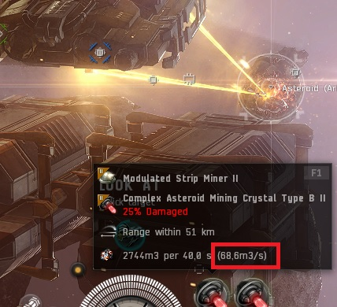
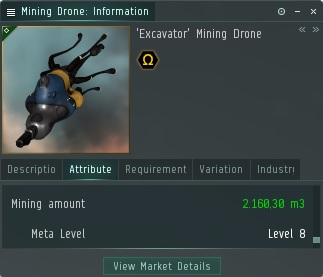
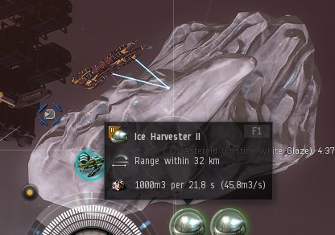
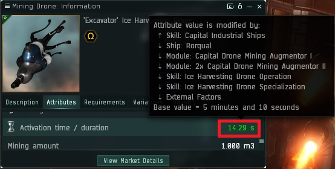

# EveOnlineMiningYield
This is a followup to a [reddit post](https://www.reddit.com/r/Eve/comments/5bp0sm/mining_yield_with_the_november_update/) which shows the comparison of the different combinations of mining ships and boost.

Currenlty this page excludes Mercoxit and Gas yields.

# Ore Mining Yield

Yield values for Ore which can be found [anywhere](https://imperium.news/eve-mining/what-to-mine/#ore_distribution)

## Ship Yields
The game displays the outcome of mining yield in the tooltip of the mining laser. For example when a hulk is boosted to the maximum possible value it displays a **40.3m3/s** value on its mining laser see this example screenshot: 



The following table shows the yield in m3/s per *mining laser* (ingame values)

|Ship|No Boost|Porpise Boot|Orca Boost|Rorqual Boost|Rorqual ICT1 Boost|Rorqual ICT2 Boost|
|:-|:-|:-|:-|:-|:-|:-|
|     Venture|    5.22|    8.50|    8.76|    9.30|   12.17|   12.96|
|   Endurance|   12.39|   20.21|   20.81|   22.11|   28.91|   30.80|
|    Prospect|    8.44|   13.77|   14.17|   15.06|   19.69|   20.99|
|    Procurer|    9.48|   15.46|   15.92|   16.92|   22.12|   23.57|
|   Retriever|   10.33|   16.84|   17.34|   18.42|   24.09|   25.67|
|     Covetor|   13.77|   22.45|   23.12|   24.57|   32.12|   34.23|
|       Skiff|   11.48|   18.71|   19.26|   20.47|   26.77|   28.52|
|    Mackinaw|   11.48|   18.71|   19.26|   20.47|   26.77|   28.52|
|        Hulk|   16.20|   26.42|   27.20|   28.90|   37.79|   40.27|

The following table shows the Yield in m3/s per *ship* (multiple mining lasers)

|Ship|No Boost|Porpise Boot|Orca Boost|Rorqual Boost|Rorqual ICT1 Boost|Rorqual ICT2 Boost|
|:-|:-|:-|:-|:-|:-|:-|
|     Venture|   10.43|   17.01|   17.51|   18.61|   24.33|   25.93|
|   Endurance|   12.39|   20.21|   20.81|   22.11|   28.91|   30.80|
|    Prospect|   16.89|   27.53|   28.35|   30.13|   39.39|   41.97|
|    Procurer|   18.97|   30.92|   31.84|   33.83|   44.24|   47.14|
|   Retriever|   20.66|   33.68|   34.67|   36.85|   48.18|   51.34|
|     Covetor|   27.54|   44.91|   46.23|   49.13|   64.24|   68.45|
|       Skiff|   22.95|   37.42|   38.53|   40.94|   53.53|   57.04|
|    Mackinaw|   22.95|   37.42|   38.53|   40.94|   53.53|   57.04|
|        Hulk|   32.40|   52.83|   54.39|   57.80|   75.58|   80.53|

The formular behind this table is calculated as followed:

```perl
	# skills 
	my $Mining_Skill                   = 5;
	my $Astrogeology_Skill             = 5;
	my $Mining_Director_Skill          = 5;
	my $Capital_Industrial_Ships_Skill = 5;
	my $Mining_Barge_Skill             = 5;
	my $Exhumer_Skill                  = 5;

	# factors 
	my $Mining_Foreman_Mindlink_bonus_1  = (1+0.25);
	my $Mining_Laser_optimization_base_1 = 0.15;
	my $Tech_2_Command_Burst_Modules_1   = (1+0.25);
	my $T2_Industrial_Core               = (1+0.36);
	my $Highwall_Mining_MX1005_Implant   = (1+0.05);
	my $mining_upgrades_x3               = (1+0.295);

	# Minig Crystal II Attribute
	my $Asteroid_Specialization_Yield_Modifier =  1.75;

	# Modulated Strip Miner II Attribute
	my $Strip_Miner_II_Mining_Amount = 450;
	my $Strip_Miner_II_Cycle_Time    = 180;

	my $rorqual_boost_t2 = $Mining_Laser_optimization_base_1
		* $Tech_2_Command_Burst_Modules_1
		* $T2_Industrial_Core
		* (1+0.1 * $Mining_Director_Skill)
		* $Mining_Foreman_Mindlink_bonus_1
		* (1+0.05*$Capital_Industrial_Ships_Skill) ;
	
	my $boost_factor = (1- $rorqual_boost_t2);

	my $hulk_base_yield =  $Strip_Miner_II_Mining_Amount 
		* $Asteroid_Specialization_Yield_Modifier
		* (1+0.05*$Mining_Skill) 
		* (1+0.05*$Astrogeology_Skill)
		* $Highwall_Mining_MX1005_Implant
		* $mining_upgrades_x3;

	my $hulk_base_time =    $Strip_Miner_II_Cycle_Time 
		* (1-0.02*$Mining_Barge_Skill)
		* (1-0.03*$Exhumer_Skill)
		* (1-0.25)  # role bonus
		* $boost_factor;

	my $mining_yield_per_second = $hulk_base_yield / $hulk_base_time;

	printf("%3.2f", $mining_yield_per_second); # prints 40.27
```

Thanks to a hint from [Lesican](https://www.reddit.com/r/Eve/comments/hhimzp/added_numbers_for_ice_mining_yield_and_updated/fwgjt6r?utm_source=share&utm_medium=web2x&context=3) the mining frigates are all fitted with a Modulated Deep Core Miner II and a Mining Crystal II rather than a Miner II in order to achieve max yield on these ships.

## Drone Yields

The Mining amount of ore collected via drones is listed in the attributes section of the info window for each drone.

The highest in-game value is 2160.30 m3



This value is calculated as followed:
```perl
	# skills 
	my $Drone_Interfacing_Skill           = 5;
	my $Mining_Drone_Operation_Skill      = 5;
	my $Mining_Drone_Specialization_Skill = 5;
	my $Industrial_Command_Ships_Skill    = 5;

	# Excavator Mining Drone base yield
	my $drone_base = 80;
	my $drone_yield_per_second = $drone_base
		* (1 + 0.1 * $Industrial_Command_Ships_Skill)
		* (1 + 0.1 * $Drone_Interfacing_Skill)
		* (1 + 0.05 * $Mining_Drone_Operation_Skill)
		* (1 + 0.02 * $Mining_Drone_Specialization_Skill)
		* (1 + 0.15 ) # medium mining drone augmentor II
		* (1 + 0.15 ) # medium mining drone augmentor II
		* (1 + 0.10 ) # medium mining drone augmentor I
		* (1 + 5.00 ); # 500% ic2 bonus

	printf("%3.2f", $drone_yield_per_second); # prints 2160.30
```

The following tables shows the yield in m3 *per 60s drone cycle*

|Ship|Mining Drone I|Mining Drone II|Augmented Mining Drone|Harvester Mining Drone|Excavator Mining Drone|
|:-|:-|:-|:-|:-|:-|
|     Venture|   68.19|   99.01|  111.02|  114.56|     N/A|
|   Endurance|   61.99|   90.01|  100.92|  104.15|     N/A|
|    Prospect|     N/A|     N/A|     N/A|     N/A|     N/A|
|    Procurer|   68.19|   99.01|  111.02|  114.56|     N/A|
|   Retriever|   59.30|   86.10|   96.54|   99.62|     N/A|
|     Covetor|   59.30|   86.10|   96.54|   99.62|     N/A|
|       Skiff|   61.99|   90.01|  100.92|  104.15|     N/A|
|    Mackinaw|   61.99|   90.01|  100.92|  104.15|     N/A|
|        Hulk|   61.99|   90.01|  100.92|  104.15|     N/A|
|    Porpoise|  153.43|  222.78|  249.79|  257.76|     N/A|
|        Orca|  204.57|  297.04|  333.05|  343.68|     N/A|
|     Rorqual|  102.29|  148.52|  166.52|  171.84|  360.05|
|Rorqual ICT1|  511.44|  742.60|  832.62|  859.21| 1800.25|
|Rorqual ICT2|  613.72|  891.13|  999.14| 1031.05| 2160.30|

Some ships allow fitting Drone Mining Augmentor Rigs. The following table these are listed as T1 for *Mining Drone Augmentor I* and T2 for *Mining Drone Augmentor II*

|Ship|Number of Drones|Drone Rigs|
|:-|:-|:-|
|Venture|2|2 x T2 + 1 x T1|
|Endurance|5 (only 3 Harvester)|2 x T2 + 1 x T1|
|Prospect|no drone bay|N/A|
|Covetor + Retriever|5|1 x T2 + 1 x T1|
|Procurer|5|2 x T2 + 1 x T1|
|Mackinaw, Skiff, Hulk|5|2 x T2|
|Porpoise, Orca, Rorqual|5|2 x T2 + 1x T1|

The following table shows the yield in m3/s per ship but *does not consider the yield loss caused by drone travel time*. 

|Ship|Mining Drone I|Mining Drone II|Augmented Mining Drone|Harvester Mining Drone|Excavator Mining Drone|
|:-|:-|:-|:-|:-|:-|
|     Venture|    2.27|    3.30|    3.70|    3.82|     N/A|
|   Endurance|    5.17|    7.50|    8.41|    5.21|     N/A|
|    Prospect|     N/A|     N/A|     N/A|     N/A|     N/A|
|    Procurer|    5.68|    8.25|    9.25|    9.55|     N/A|
|   Retriever|    4.94|    7.17|    8.04|    8.30|     N/A|
|     Covetor|    4.94|    7.17|    8.04|    8.30|     N/A|
|       Skiff|    5.17|    7.50|    8.41|    8.68|     N/A|
|    Mackinaw|    5.17|    7.50|    8.41|    8.68|     N/A|
|        Hulk|    5.17|    7.50|    8.41|    8.68|     N/A|
|    Porpoise|   12.79|   18.57|   20.82|   21.48|     N/A|
|        Orca|   17.05|   24.75|   27.75|   28.64|     N/A|
|     Rorqual|    8.52|   12.38|   13.88|   14.32|   30.00|
|Rorqual ICT1|   42.62|   61.88|   69.38|   71.60|  150.02|
|Rorqual ICT2|   51.14|   74.26|   83.26|   85.92|  180.03|

(ICT1 + ICT2 indicates if a rorqual as the Industrial Core I or Industrial Core II being active.)

# Ice Mining Yield

Yield values for Ice which can be found [in ice belts](https://imperium.news/eve-mining/what-to-mine/#ice_mining)

## Ship Yields

Max yield for Ice is 45.8m3/s as shown in screenshot below



The following table shows the yield in m3/s per *ice harvester* (ingame values)

|Ship|No Boost|Porpise Boot|Orca Boost|Rorqual Boost|Rorqual ICT1 Boost|Rorqual ICT2 Boost|
|:-|:-|:-|:-|:-|:-|:-|
|     Venture|     N/A|     N/A|     N/A|     N/A|     N/A|     N/A|
|   Endurance|   20.07|   32.72|   33.69|   35.80|   46.81|   49.88|
|    Prospect|    6.20|   10.11|   10.41|   11.06|   14.47|   15.41|
|    Procurer|   10.70|   17.45|   17.96|   19.09|   24.96|   26.59|
|   Retriever|   11.76|   19.17|   19.74|   20.98|   27.43|   29.22|
|     Covetor|   15.68|   25.56|   26.32|   27.97|   36.57|   38.97|
|       Skiff|   13.06|   21.30|   21.93|   23.31|   30.47|   32.47|
|    Mackinaw|   13.06|   21.30|   21.93|   23.31|   30.47|   32.47|
|        Hulk|   18.44|   30.07|   30.96|   32.90|   43.02|   45.84|

The following table shows the Yield in m3/s per *ship* (multiple mining lasers)

|Ship|No Boost|Porpise Boot|Orca Boost|Rorqual Boost|Rorqual ICT1 Boost|Rorqual ICT2 Boost|
|:-|:-|:-|:-|:-|:-|:-|
|     Venture|     N/A|     N/A|     N/A|     N/A|     N/A|     N/A|
|   Endurance|   20.07|   32.72|   33.69|   35.80|   46.81|   49.88|
|    Prospect|   12.40|   20.23|   20.82|   22.13|   28.93|   30.83|
|    Procurer|   21.40|   34.89|   35.92|   38.18|   49.92|   53.19|
|   Retriever|   23.52|   38.34|   39.48|   41.95|   54.85|   58.45|
|     Covetor|   31.35|   51.13|   52.64|   55.94|   73.14|   77.93|
|       Skiff|   26.13|   42.61|   43.86|   46.61|   60.95|   64.94|
|    Mackinaw|   26.13|   42.61|   43.86|   46.61|   60.95|   64.94|
|        Hulk|   36.89|   60.15|   61.92|   65.81|   86.04|   91.68|

The formular behind this table is calculated as followed:

```perl
my $Mining_Director_Skill          = 5;
my $Capital_Industrial_Ships_Skill = 5;
my $Mining_Foreman_Mindlink_bonus_1  = (1+0.25);
my $Tech_2_Command_Burst_Modules_1   = (1+0.25);
my $T2_Industrial_Core               = (1+0.36);
my $Mining_Laser_optimization_base_1 = 0.15;

my $boost_factor = 1 - $Mining_Laser_optimization_base_1
			* $Tech_2_Command_Burst_Modules_1
			* $T2_Industrial_Core
			* (1+0.1 * $Mining_Director_Skill)
			* $Mining_Foreman_Mindlink_bonus_1
			* (1+0.05*$Capital_Industrial_Ships_Skill) ;

my $Mining_Barge_Skill             = 5;
my $Exhumer_Skill                  = 5;
my $Ice_Harvesting_Skill           = 5;
my $Ice_Harvester_II_Base_Duration = 200;
my $Ice_Harvester_Upgrade_II       = 0.09;
my $Yeti_Harvesting_IH_1005_Implant = 0.05;

my $Ice_Harvester_Cycle_Time = $Ice_Harvester_II_Base_Duration
							* (1 - 0.25) # role bonus
							* (1 - 0.02 * $Mining_Barge_Skill )
							* (1 - 0.03 * $Exhumer_Skill )
							* (1 - 0.05 * $Ice_Harvesting_Skill )
							* (1 - 0.12 ) # Medium Ice Harvesting Accelerator I
							* (1 - $Ice_Harvester_Upgrade_II ) 
							* (1 - $Ice_Harvester_Upgrade_II) 
							* (1 - $Ice_Harvester_Upgrade_II) 
							* (1 - $Yeti_Harvesting_IH_1005_Implant) 
							* $boost_factor;

printf("%3.2f", 1000 / $Ice_Harvester_Cycle_Time ) # prints "45.84"
```

## Drone Yields

The minimum cycle time of an Ice Harvesting Drone is *13.61s* as shown in the screenshot below:



This value is calculated as followed
```perl
my $Excavator_Ice_Harvesting_Drone_Duration = 310;
my $Ice_Harvesting_Drone_Operation_Skill = 5;
my $Ice_Harvesting_Drone_Specialication_Skill = 5;
my $Capital_Industrial_Ships_Skill = 5;

my $drone_cycle_duration =$Excavator_Ice_Harvesting_Drone_Duration
	* (1 - 0.05 * $Ice_Harvesting_Drone_Operation_Skill)
	* (1 - 0.02 * $Ice_Harvesting_Drone_Specialication_Skill)
	* (1 - 0.10 * $Capital_Industrial_Ships_Skill)
	* (1 - 0.80) # Industrial Core II Bonus
	* (1 - 0.10) # Medium Drone Mining Augmentor I
	* (1 - 0.15) # Medium Drone Mining Augmentor II
	* (1 - 0.15) # Medium Drone Mining Augmentor II
	;

printf("%3.2f", $drone_cycle_duration ) # prints 13.61
```

Note that the Mining Drone I and Harvester Mining Drone do not get a bonus from the Mining Drone Specialization Skill

The cycle time varies depending on  the number of Drone Mining Augmentor Rigs fitted to the ship. Some ships (Venture, Prospect, Endurance, Retriever) cannot use the harvester mining drone becacause there is not enough room in the drone bay.
Except for the rorqual only 1 harvester drone can be launched because of the bandwidth needed per drone.

|Ship|Number of Drones|Drone Rigs|
|:-|:-|:-|
|Venture|0|N/A|
|Prospect|0|N/A|
|Endurance|0|N/A|
|Retriever|0|N/A|
|Covetor|1|no drone rigs|
|Procurer|1|2 x T2 + 1 x T1|
|Procurer, Skiff, Mackinaw, Hulk|1|1 x T2|
|Porpoise, Orca, Rorqual|1|2 x T2 + 1x T1|
|Rorqual|5|2 x T2 + 1x T1|

The following tables shows the cycle time for a drone depending on which ship is used with the rigs listed above. 

|Ship|Ice Harvesting Drone I|Ice Harvesting Drone II|Augmented Ice Harvesting Drone|Excavator Ice Harvesting Drone|
|:-|:-|:-|:-|:-|
|     Venture|        |        |        |        |
|   Endurance|        |        |        |        |
|    Prospect|        |        |        |        |
|    Procurer|        |        |        |        |
|   Retriever|        |        |        |        |
|     Covetor|  222.75|  202.50|  189.00|        |
|       Skiff|  189.34|  172.12|  160.65|        |
|    Mackinaw|  189.34|  172.12|  160.65|        |
|        Hulk|  189.34|  172.12|  160.65|        |
|    Porpoise|   72.42|   65.84|   61.45|        |
|        Orca|   54.32|   49.38|   46.09|        |
|     Rorqual|   72.42|   65.84|   61.45|   68.03|
|Rorqual ICT1|   18.11|   16.46|   15.36|   17.01|
|Rorqual ICT2|   14.48|   13.17|   12.29|   13.61|


The following table shows the yield in m3/s per ship but *does not consider the yield loss caused by drone travel time*. 

|Ship|Ice Harvesting Drone I|Ice Harvesting Drone II|Augmented Ice Harvesting Drone|Excavator Ice Harvesting Drone|
|:-|:-|:-|:-|:-|
|     Venture|        |        |        |        |
|   Endurance|        |        |        |        |
|    Prospect|        |        |        |        |
|    Procurer|    5.28|    5.81|    6.22|        |
|   Retriever|        |        |        |        |
|     Covetor|    4.49|    4.94|    5.29|        |
|       Skiff|   10.56|   11.62|   12.45|        |
|    Mackinaw|    5.28|    5.81|    6.22|        |
|        Hulk|    5.28|    5.81|    6.22|        |
|    Porpoise|   13.81|   15.19|   16.27|        |
|        Orca|   18.41|   20.25|   21.70|        |
|     Rorqual|   27.62|   30.38|   32.55|   73.49|
|Rorqual ICT1|  110.46|  121.51|  130.19|  293.98|
|Rorqual ICT2|  138.08|  151.89|  162.74|  367.47|

# Gas Mining Yield
*To be done*

## Code
The code to generate these tables is [here](EveOnlineMiningYield.pl)

# COPYRIGHT NOTICE
EVE Online and the EVE logo are the registered trademarks of CCP hf. All rights are reserved worldwide. All other trademarks are the property of their respective owners. EVE Online, the EVE logo, EVE and all associated logos and designs are the intellectual property of CCP hf. All artwork, screenshots, characters, vehicles, storylines, world facts or other recognizable features of the intellectual property relating to these trademarks are likewise the intellectual property of CCP hf. CCP hf. has granted permission to EveOnlineMiningYield to use EVE Online and all associated logos and designs for promotional and information purposes on its website but does not endorse, and is not in any way affiliated with, EveOnlineMiningYield. CCP is in no way responsible for the content on or functioning of this website, nor can it be liable for any damage arising from the use of this website.
